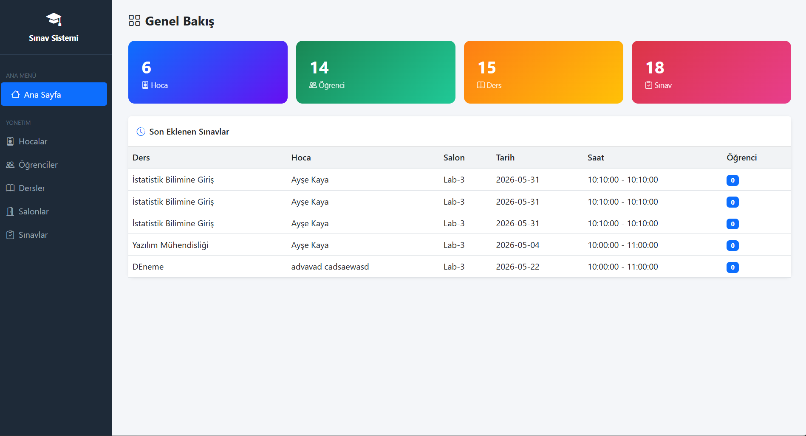

# Sınav Sistemi / Exam Management System

## 📌 Proje Açıklaması
İlişkisel bir veritabanı tasarlanmış, bu veritabanı üzerine ASP.NET Core Web API geliştirilmiş, Swagger ile dokümantasyon sağlanmış ve .NET Core MVC ile kullanıcı arayüzü oluşturulmuştur.

A relational database was designed, an ASP.NET Core Web API was developed, documented with Swagger, and a user interface was built using .NET Core MVC.

## 🚀 Teknolojiler
- ASP.NET Core Web API
- ASP.NET Core MVC
- Entity Framework Core
- SQL Server
- Swagger
- Bootstrap

## 📂 Özellikler
- Öğrenci yönetimi
- Ders yönetimi
- Sınav sistemi
- Salon planlama
- Not giriş sistemi
- API üzerinden CRUD işlemleri

## 🔧 Kurulum
1. Database'i SQL Server'a import et
2. API projesini çalıştır
3. MVC projesini çalıştır
4. Swagger: https://localhost:xxxx/swagger

## 🖼️ Ekran Görüntüleri
## Screenshots

